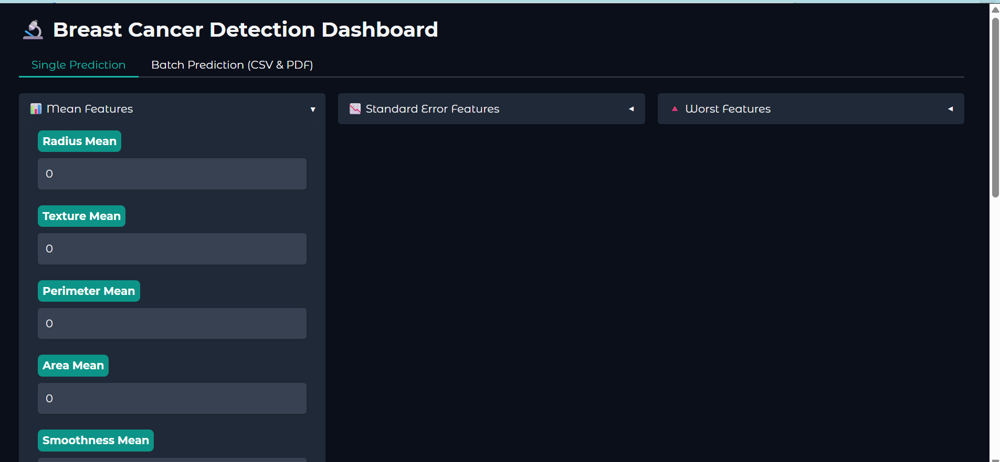
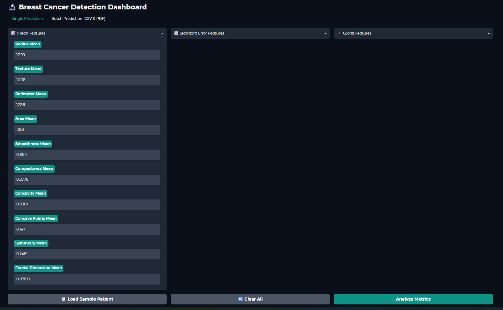
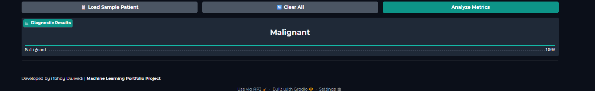
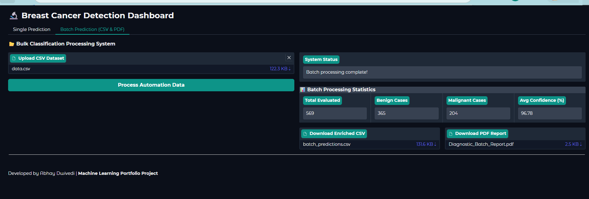

# 🩺 Breast Cancer Detection using Machine Learning

An end-to-end Machine Learning classification project that predicts whether a breast tumor is **Benign** or **Malignant** using **Logistic Regression**. The project includes data preprocessing, exploratory data analysis (EDA), model training, evaluation, and deployment using **Gradio**.

---

## 📌 Project Overview

Breast cancer is one of the most common cancers worldwide. Early detection can significantly improve treatment outcomes.

This project uses diagnostic features extracted from breast cell images to predict whether a tumor is:

* ✅ Benign
* ❌ Malignant

The model is trained using Logistic Regression and deployed through an interactive Gradio web application.

---

## 🎯 Problem Statement

Given diagnostic measurements of a breast mass, predict whether the tumor is benign or malignant.

### Target Variable

* B → Benign
* M → Malignant

---

## 📊 Dataset Features

The model was trained using 30 numerical features:

* radius_mean
* texture_mean
* perimeter_mean
* area_mean
* smoothness_mean
* compactness_mean
* concavity_mean
* concave points_mean
* symmetry_mean
* fractal_dimension_mean

and their corresponding:

* Standard Error Features
* Worst Features

Total Features: **30**

---

## 🔍 Exploratory Data Analysis (EDA)

Performed:

* Missing Value Analysis
* Duplicate Value Check
* Summary Statistics
* Univariate Analysis
* Correlation Analysis
* Target Distribution Analysis
* Outlier Detection

---

## ⚙️ Machine Learning Workflow

1. Data Collection
2. Data Cleaning
3. Exploratory Data Analysis
4. Feature Selection
5. Train-Test Split
6. Feature Scaling (StandardScaler)
7. Logistic Regression Training
8. Model Evaluation
9. Model Deployment

---

## 🤖 Model Used

### Logistic Regression

Evaluation Metrics:

* Accuracy Score
* Precision Score
* Recall Score
* F1 Score
* Confusion Matrix
* Classification Report

---

## 🖥️ Web Application Features

* Single Patient Prediction
* Batch CSV Prediction
* Download Prediction CSV
* Download PDF Report
* Prediction Probability
* Interactive Gradio Dashboard

---

## 📸 Application Screenshots

### 🏠 Home Page



### 📝 Single Prediction Input



### 🎯 Prediction Result



### 📂 Batch Prediction



---

## 🛠️ Technologies Used

* Python
* Pandas
* NumPy
* Matplotlib
* Seaborn
* Scikit-Learn
* Joblib
* Gradio

---

## 📂 Project Structure

```text
Breast-Cancer-Detection/
│
├── app.py
├── breast_cancer_model.pkl
├── scaler.pkl
├── requirements.txt
├── README.md
├── Breast_Cancer_Predication.ipynb
│
├── HomePage.png
├── Input.png
├── Output.png
├── BatchPredication.png
│
├── batch_predictions.csv
└── Diagnostic_Batch_Report.pdf
```

---

## 🚀 Installation

Clone the repository:

```bash
git clone https://github.com/AbhayDw/Breast-Cancer-Detection.git
```

Install dependencies:

```bash
pip install -r requirements.txt
```

Run the application:

```bash
python app.py
```

---

## 📈 Future Improvements

* Random Forest Classifier
* XGBoost Classifier
* Hyperparameter Tuning
* Model Comparison Dashboard
* Advanced Explainability (SHAP)

---

## 📝 Development Note

The machine learning workflow, data preprocessing, feature engineering, model training, evaluation, and deployment were implemented by me.

AI coding assistants were used to improve code readability, UI design, and documentation.

---

## 👨‍💻 Author

**Abhay Dwivedi**

B.Tech CSE (Cyber Security)

Aspiring Data Scientist & Machine Learning Engineer
